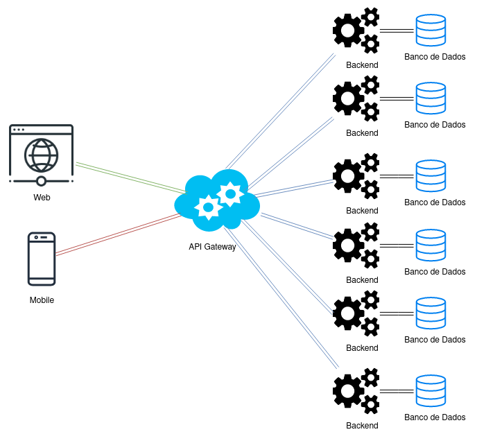

# Arquitetura da Solução

<span style="color:red">Pré-requisitos: <a href="3-Projeto de Interface.md"> Projeto de Interface</a></span>

Definição de como o software é estruturado em termos dos componentes que fazem parte da solução e do ambiente de hospedagem da aplicação.



## Diagrama de Classes


## Documentação do Banco de Dados MongoDB

Este documento descreve a estrutura e o esquema do banco de dados não relacional utilizado por nosso projeto, baseado em MongoDB. O MongoDB é um banco de dados NoSQL que armazena dados em documentos JSON (ou BSON, internamente), permitindo uma estrutura flexível e escalável para armazenar e consultar dados.

## Esquema do Banco de Dados

### Criação do banco de dados via compass e pelo shell foi visualizado se realmente o CHECAR foi criado.


### Coleção: Usuário
Armazena as informações dos usuários do sistema.

Estrutura do Documento

```Json
/** 
* usuarios checar
*/
{
  "_id": {
    "$oid": "69be8eb670e2e5bbf7d395bc"
  },
  "nome": "Gabriela",
  "email": "gabriela@checar.com.br",
  "senha": "hash_da_senha",
  "tipoUsuario": [
    "admin",
    "user"
  ]
}
```

#### Descrição dos Campos
> - <strong>_id:</strong> Identificador único do usuário gerado automaticamente pelo MongoDB.
> - <strong>name:</strong> Nome completo do usuário.
> - <strong>email:</strong> Endereço de email do usuário.
> - <strong>senha:</strong> Hash da senha do usuário.
> - <strong>tipoUsuario:</strong> Lista de papéis atribuídos ao usuário (por exemplo, admin, user).

### Coleção: Veiculo
Armazena as informações dos produtos disponíveis no sistema.

```Json
{
  "placa": "ASHWG-1234",
  "modelo": "Uno",
  "ano": 2024,
  "marca": "Fiat",
  "cor": "Prata"
}
```

#### Descrição dos Campos
> - <strong>_id:</strong> Identificador único do veículo gerado automaticamente pelo MongoDB.
> - <strong>placa:</strong> Placa do veículo.
> - <strong>modelo:</strong> Modelo do veículo.
> - <strong>ano:</strong> Ano do veículo.

### Coleção: Checklist
Armazena as informações dos produtos disponíveis no sistema.

Estrutura do Documento

```Json
{
  "_id": { "$oid": "69be945b70e2e5bbf7d395c5" },
  "data": "2026-03-21T00:00:00Z",
  "conformidade": true,
  "observacao": "ar condicionado com defeito",
  "status": ["em utilização", "com problema", "disponível"]
}
```

#### Descrição dos Campos
> - <strong>_id:</strong> Identificador único do checklist realizado gerado automaticamente pelo MongoDB.
> - <strong>data:</strong> Data em que foi realizado o checklist.
> - <strong>conformidade:</strong> Se o veículo está ou não disponível e em bom estado para a utilização.
> - <strong>observacao:</strong> Campo de observação para que o usuário possa adicionar indicações sobre o status do veículo.
> - <strong>status:</strong> Status de utilização do veículo caso esteja disponível para uso, um utilização ou com problema.

### Coleção: ModeloChecklist
Armazena as informações do checklist realizado pelo usuário.

Estrutura do Documento

```Json
{
  "_id": {
    "$oid": "69be965370e2e5bbf7d395c7"
  },
  "nome": "Checklist Diário Veículo",
  "tipo": "veiculo",
  "descricao": "Checklist para verificação diária das condições do veículo"
}
```

#### Descrição dos Campos
> - <strong>_id:</strong> Identificador único do modelo de checklist gerado automaticamente pelo MongoDB.
> - <strong>nome:</strong> Nome do Checklist.
> - <strong>tipo:</strong> Tipo de veículo
> - <strong>descricao:</strong> Descrição do checklist

### Coleção: Notificação
Notificações ao usuário

Estrutura do Documento

```Json
{
  "_id": { "$oid": "69bebbbb70e2e5bbf7d39610" },
  "mensagem": "Veículo com problema no ar condicionado",
  "data": "2026-03-21T12:30:00Z",
  "tipo": "ALERTA"
}
```

#### Descrição dos Campos
> - <strong>_id:</strong> Identificador único do modelo de checklist gerado automaticamente pelo MongoDB.
> - <strong>mensagem:</strong> Mensagem deixada pelo usuário que realizou o checklist.
> - <strong>data:</strong> Data em que foi realizado o checklist
> - <strong>tipo:</strong> Tipo de notificação

### Coleção: Relatório
Relatório para acompanhamento do usuário

Estrutura do Documento

```Json
{
  "_id": { "$oid": "69becccc70e2e5bbf7d39620" },
  "dataGeracao": "2026-03-21T13:00:00Z",
  "tipo": "CHECKLIST"
}
```

#### Descrição dos Campos
> - <strong>_id:</strong> Identificador único do modelo de checklist gerado automaticamente pelo MongoDB.
> - <strong>dataGeracao:</strong> Dia que foi gerado o relatório.
> - <strong>tipo:</strong> Tipo de relatório


### Coleção: ItemChecklist
Itens individuais que compõe o checklist

Estrutura do Documento

```Json
{
  "_id": { "$oid": "69bedddd70e2e5bbf7d39630" },
  "descricao": "Ar condicionado funcionando",
  "status": "OK"
}
```

#### Descrição dos Campos
> - <strong>_id:</strong> Identificador único dos itens de atividade de checklist gerado automaticamente pelo MongoDB.
> - <strong>descricao:</strong> Descrição do item do checklist.
> - <strong>status:</strong> status do item, ok, em condições razoáveis ou não funcionando

### Coleção: Foto
Foto do veículo

Estrutura do Documento

```Json
{
  "_id": { "$oid": "69beeeee70e2e5bbf7d39640" },
  "titulo": "Ar condicionado",
  "url": "https://meusite.com/uploads/foto1.jpg",
  "dataUpload": "2026-03-21T13:30:00Z"
}
```

#### Descrição dos Campos
> - <strong>_id:</strong> Identificador único dos itens de atividade de checklist gerado automaticamente pelo MongoDB.
> - <strong>titulo:</strong> Titulo dado pelo usuário no momento da foto.
> - <strong>url:</strong> endereço da foto
> - <strong>dataUpload:</strong> Quando foi realizado o upload da foto

### Coleção: Assinatura
Assinatura do responsável do checklist

Estrutura do Documento

```Json
{
  "_id": { "$oid": "69beffff70e2e5bbf7d39650" },
  "imagemAssinatura": "https://meusite.com/uploads/assinatura.png",
  "data": "2026-03-21T13:40:00Z"
}
```

#### Descrição dos Campos
> - <strong>_id:</strong> Identificador único dos itens de atividade de checklist gerado automaticamente pelo MongoDB.
> - <strong>imagemAssinatura:</strong> Imagem da assinatura do responsável.
> - <strong>data:</strong> Quando foi realizado a assinatura pelo responsável

## Tecnologias Utilizadas

Descreva aqui qual(is) tecnologias você vai usar para resolver o seu problema, ou seja, implementar a sua solução. Liste todas as tecnologias envolvidas, linguagens a serem utilizadas, serviços web, frameworks, bibliotecas, IDEs de desenvolvimento, e ferramentas.

Apresente também uma figura explicando como as tecnologias estão relacionadas ou como uma interação do usuário com o sistema vai ser conduzida, por onde ela passa até retornar uma resposta ao usuário.

## Hospedagem

Explique como a hospedagem e o lançamento da plataforma foi feita.

> **Links Úteis**:
>
> - [Website com GitHub Pages](https://pages.github.com/)
> - [Programação colaborativa com Repl.it](https://repl.it/)
> - [Getting Started with Heroku](https://devcenter.heroku.com/start)
> - [Publicando Seu Site No Heroku](http://pythonclub.com.br/publicando-seu-hello-world-no-heroku.html)

## Qualidade de Software

Conceituar qualidade de fato é uma tarefa complexa, mas ela pode ser vista como um método gerencial que através de procedimentos disseminados por toda a organização, busca garantir um produto final que satisfaça às expectativas dos stakeholders.

No contexto de desenvolvimento de software, qualidade pode ser entendida como um conjunto de características a serem satisfeitas, de modo que o produto de software atenda às necessidades de seus usuários. Entretanto, tal nível de satisfação nem sempre é alcançado de forma espontânea, devendo ser continuamente construído. Assim, a qualidade do produto depende fortemente do seu respectivo processo de desenvolvimento.

A norma internacional ISO/IEC 25010, que é uma atualização da ISO/IEC 9126, define oito características e 30 subcaracterísticas de qualidade para produtos de software.
Com base nessas características e nas respectivas sub-características, identifique as sub-características que sua equipe utilizará como base para nortear o desenvolvimento do projeto de software considerando-se alguns aspectos simples de qualidade. Justifique as subcaracterísticas escolhidas pelo time e elenque as métricas que permitirão a equipe avaliar os objetos de interesse.

> **Links Úteis**:
>
> - [ISO/IEC 25010:2011 - Systems and software engineering — Systems and software Quality Requirements and Evaluation (SQuaRE) — System and software quality models](https://www.iso.org/standard/35733.html/)
> - [Análise sobre a ISO 9126 – NBR 13596](https://www.tiespecialistas.com.br/analise-sobre-iso-9126-nbr-13596/)
> - [Qualidade de Software - Engenharia de Software 29](https://www.devmedia.com.br/qualidade-de-software-engenharia-de-software-29/18209/)
